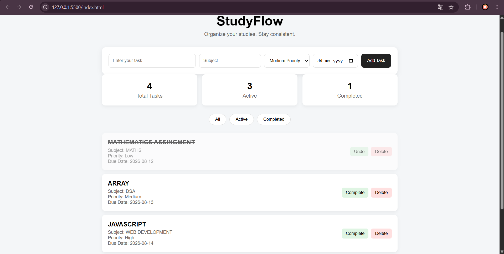

# StudyFlow 📚

A responsive student study planner built using HTML, CSS and JavaScript.

## Features

- Add study tasks
- Set subject, priority and due date
- Mark tasks as completed
- Delete tasks
- Filter tasks by All, Active and Completed
- Task statistics dashboard
- Data persistence using LocalStorage
- Responsive design

## Technologies Used

- HTML5
- CSS3
- JavaScript
- LocalStorage

## Screenshot

## What I Learned

- DOM manipulation
- JavaScript event handling
- Arrays and objects
- `map()` and `filter()`
- LocalStorage
- Dynamic HTML generation
- Responsive CSS

## How to Run

1. Download or clone the repository.
2. Open the project folder in VS Code.
3. Open `index.html` using Live Server.